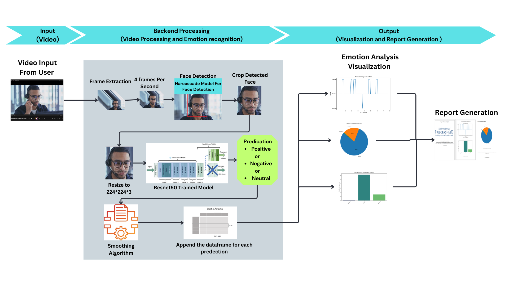
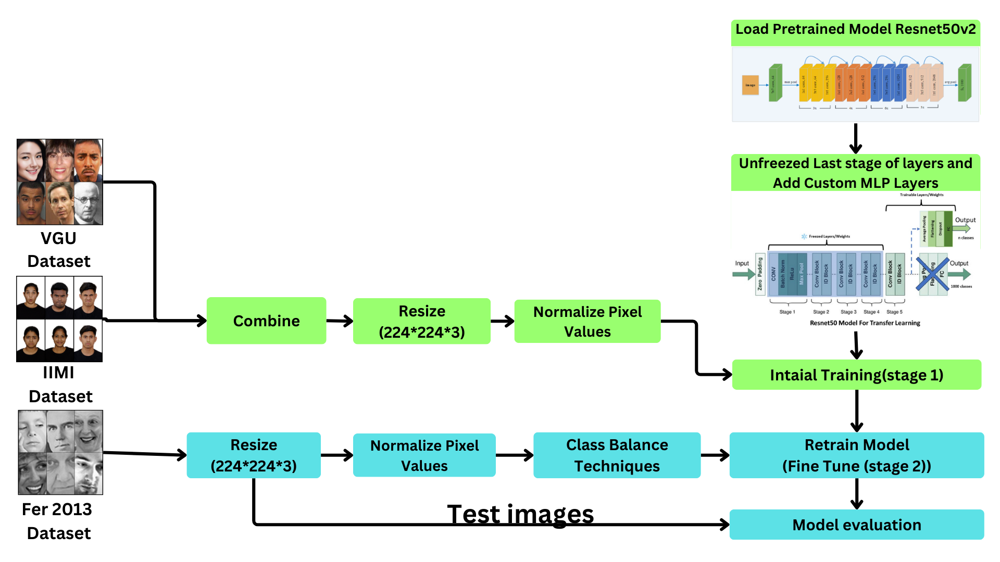
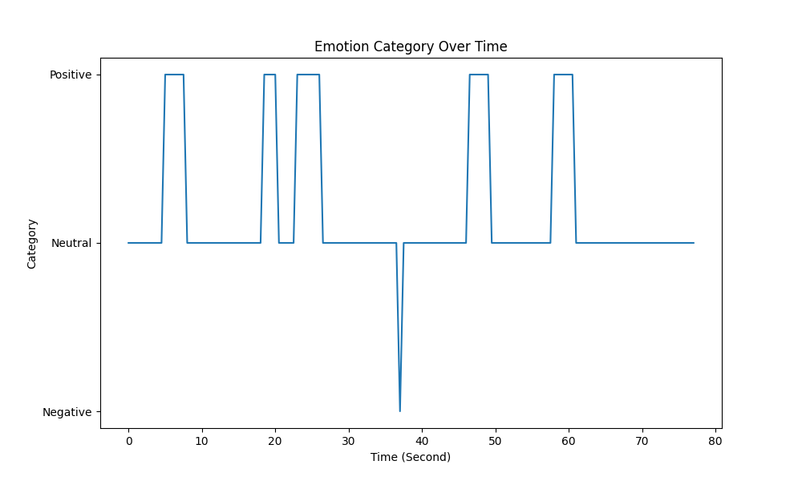
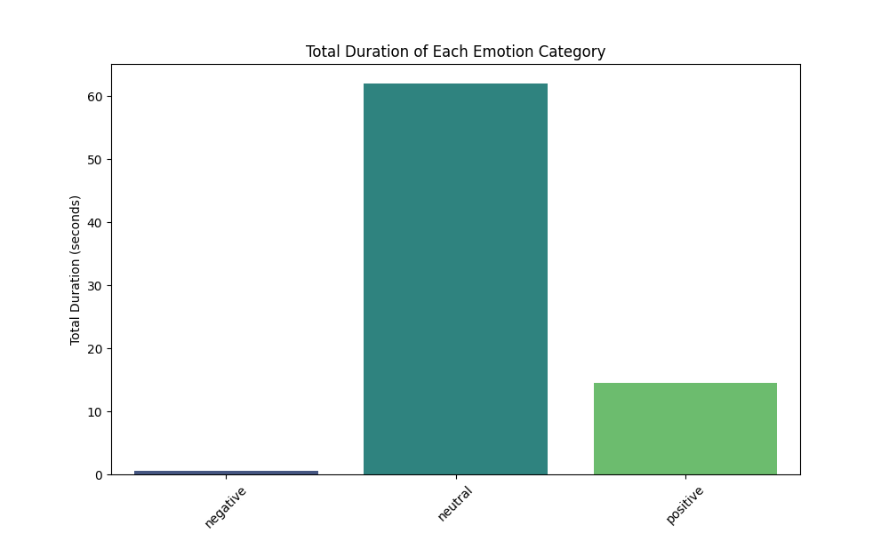
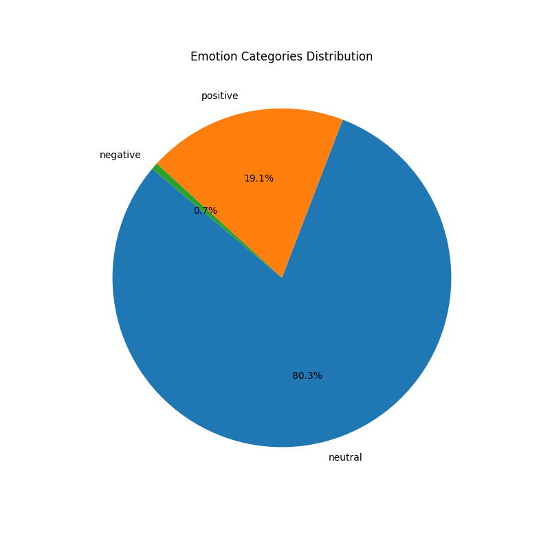

# **Facial Emotion Recognition from Video Using Deep Learning**

This project implements a real-time facial emotion recognition system using a **CNN-based architecture** with **transfer learning** from **ResNet-50**, focusing on efficient computation and high accuracy. The system is designed to detect emotions from video data and provides detailed visual and statistical reports.

## **Table of Contents**
- [Overview](#overview)
- [Features](#features)
- [System Architecture](#system-architecture)
- [Installation](#installation)
- [Usage](#usage)
- [Results](#results)
- [Future Work](#future-work)
- [Acknowledgments](#acknowledgments)

---

## **Overview**
This project addresses the need for accurate and efficient facial emotion detection in real-time video analysis, essential for fields like **telehealth**, **virtual meetings**, and **human-computer interaction**. The model is built using **CNN** and transfer learning from **ResNet-50**, achieving high accuracy with minimal computing resource expense. The system processes videos, detects emotions, and generates detailed reports and visualizations.

---

## **Features**
- Real-time video analysis using **CNN-based architecture** with **ResNet-50**.
- User-friendly interface powered by **Gradio** for video upload/recording.
- Exports detailed reports in **PDF** and **CSV** formats for future analysis.
- Visual emotion trends through **line graphs**, **bar charts**, and **pie charts**.
- Deployed on **Hugging Face** for easy access.

---

## **System Architecture**
The flow of the system includes the following steps:
1. **Video Upload/Record**: Users can upload or record video files.
2. **Frame Extraction**: Extracts frames at 4 frames per second.
3. **Face Detection**: Detects and crops faces using **Haarcascade**.
4. **Emotion Prediction**: Uses **ResNet-50** for emotion detection.
5. **Smoothing Algorithm**: Applied to smooth emotion transitions across frames.
6. **Report Generation**: Generates CSV and PDF reports, along with visual graphs.

**System Architecture**


**Model trainning**


---

## **Installation**

To set up the project on your local machine, follow these steps:

1. Clone the repository:
    ```bash
    git clone https://github.com/yourusername/facial-emotion-recognition.git
    cd facial-emotion-recognition
    ```

2. Install the required dependencies:
    ```bash
    pip install -r requirements.txt
    ```

3. Run the system:
    ```bash
    python app.py
    ```

---

## **Usage**

1. **Upload or Record a Video**: Through the Gradio interface, you can either upload a pre-recorded video or record a video directly.
2. **Real-time Emotion Detection**: The system will analyze the video and detect emotions in real-time.
3. **View Visual Reports**: Get instant visual feedback with **line graphs**, **bar charts**, and **pie charts** showing emotional trends.
4. **Download Reports**: Export results in **CSV** and **PDF** formats for detailed analysis.

---

## **Results**
The system has been extensively tested and achieved the following:
- **95% accuracy** in emotion detection after applying the smoothing algorithm.
- Comparative performance of models:
  - **ResNet-50**: 78% accuracy.
  - **VGG16**: 52% accuracy.
  - **Hybrid Model**: 39% accuracy.

### Example Outputs:
- **Emotion Trends (Line Graph)**:
  
  
- **Bar Plot of Emotions**:
  

- **Pie Chart of Emotions**:
  

---

## **Future Work**
- Expand the dataset for broader cultural and demographic representation.
- Implement a **multi-task model** to simultaneously recognize faces and detect emotions, generating individualized reports.
- Improve real-time emotion detection for live video feeds.

---

## **Acknowledgments**
I would like to thank my supervisor, **Dr. Tianhua Chen**, for his guidance and support throughout this project. I also appreciate the **University of Huddersfield** for providing resources and encouragement during this research.

---

